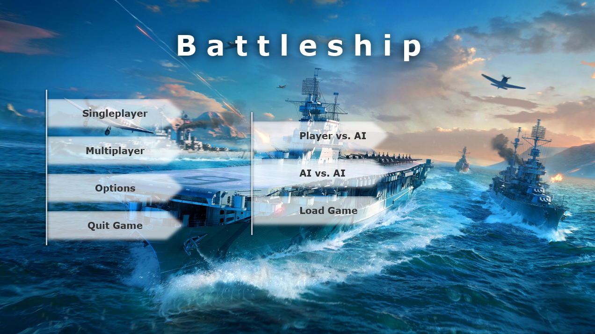
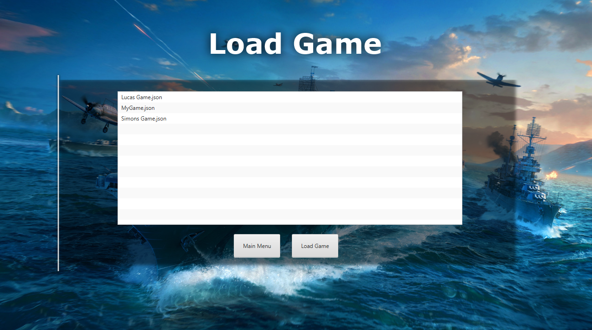
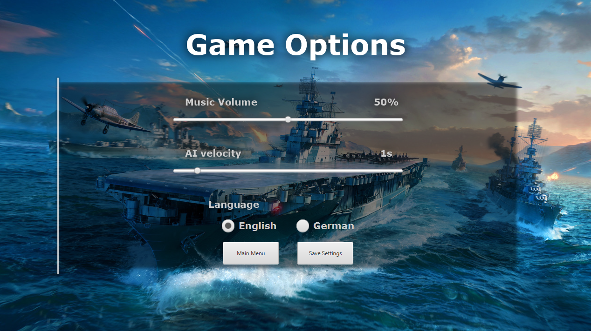
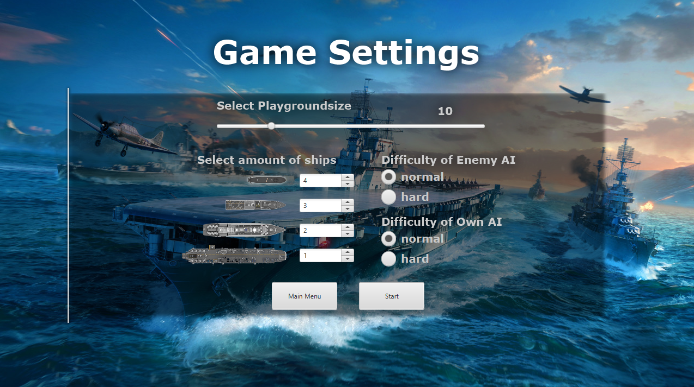
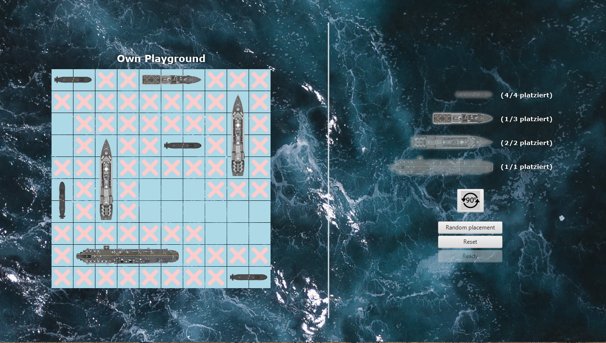
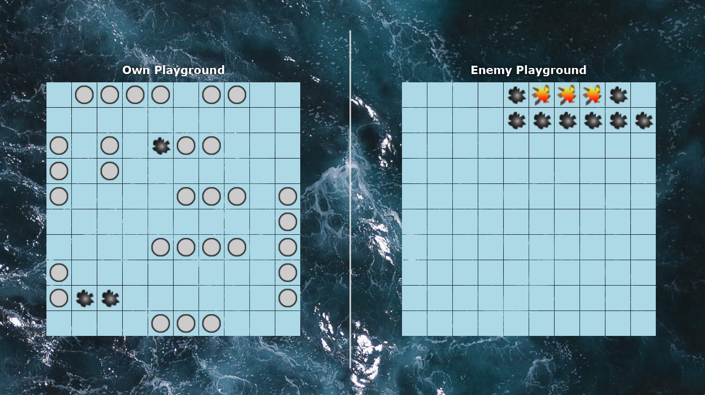
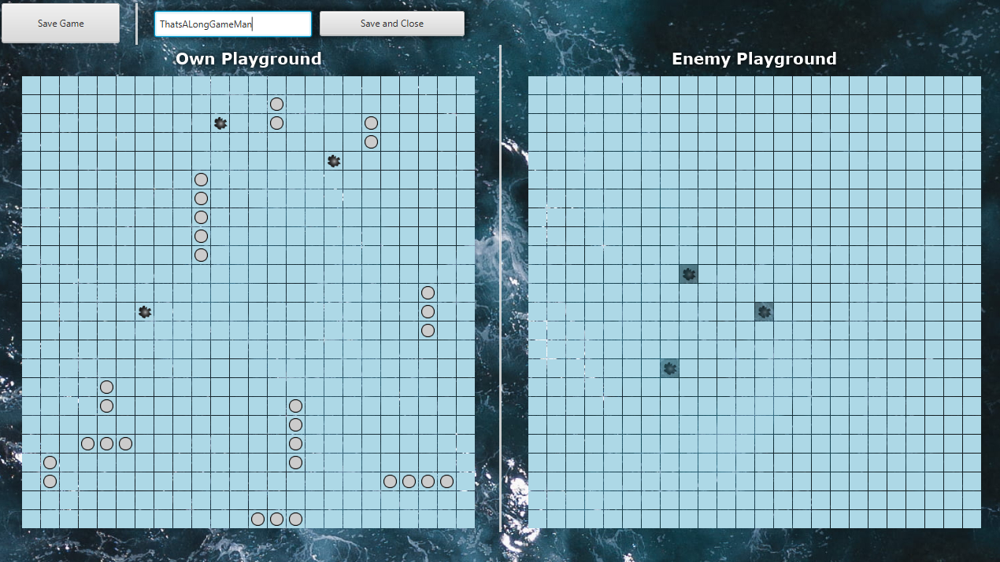
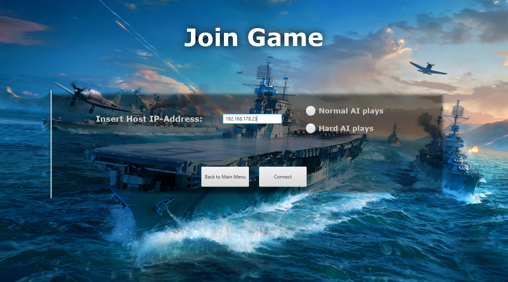
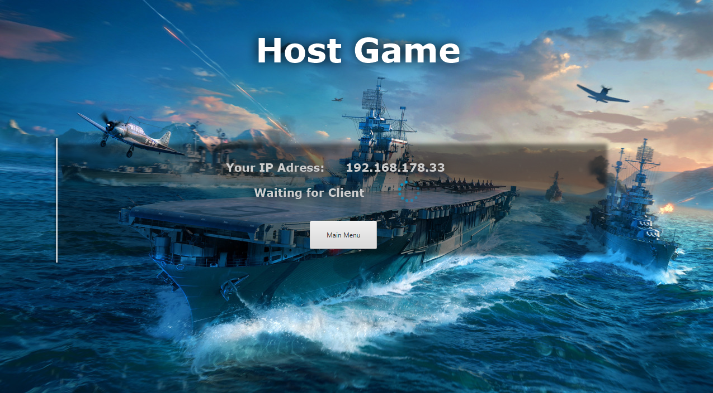

# 🚢 BattleShip – Let the battle begin!

Welcome to our first fully realized game project: **BattleShip**!  
A turn-based tactics game for two players – either against a friend or a custom-built AI.

Creating this game was our introduction to our very first "real" project.

---

## 🎓 Project & Context

This project was developed as part of our studies at **Aalen University** during the **“Programmierpraktikum”** (Programming Lab) course.  
Beyond building a working game, we also learned what it's like to collaborate in a real software development team:  
**project planning, team roles, communication, code integration**, and ultimately: delivering a playable product.

One unique aspect of the course was a shared **network protocol**. All teams agreed on a **common socket-based interface**, implemented it individually, and were then able to play against each other across the different implementations.
This repository presents our version of the game.

---

## 🔧 Features

- 🌐 **Networked Multiplayer**
- 🤖 **Play against AI**
- 🎮 **Multiplayer** 
- 🎨 **Graphical User Interface**
- 💾 **Save & Load**
- 📊 **Flexible board sizes and ship counts**
- 🔄 **AI vs. AI mode**

---

## 🕹️ Gameplay Overview

### 1. Game Menu

Start the game via the main menu and choose your mode:

- **Singleplayer** 
  - Play against the AI
  - Let two AI`s play against each other!
- **Multiplayer**
  - Play as client or host
  - You can also let an Ai play for you!
- **Options**
  - Adjust the AI shooting speed, the volume of the music and the language
  

### 2. Game Setup
- **Grid size of the game**
- **The amount of ships of each type**
- **The AI difficulty**  

### 3. Ship Placement

- Drag & drop ships onto your grid
- Optionaly you can also automatically place your ships
- Supports varying numbers and sizes of ships

### 3. Battle!
Play solo, multiplayer, or watch AI battles.

---

## 🎨 User Interface

- Built with JavaFX
- Responsive controls and inputs
- Extensively utilizing animations with sliders
- Drag & drop

|             |              |  |
|------------------------------------|------------------------------------------|----------------------------|
|  |  |  | 
|    |  |  | 

---

## 🌍 Multiplayer

Play locally or over via LAN.

You can use [Hamachi](https://vpn.net/) for remote connections.
We used it during the development with other battleship teams to play against each other and it worked just fine!

### Host
- Share your IP with the client
- Select map and ship settings

### Client
- Enter IP from the server
- Choose between player or AI control

Multiplayer also supports **saving and loading**!

  
Player vs Player

AI vs AI

> Thanks to a strict socket protocol, cheating is **not possible**.  
> Our hard AI has dominated **every** inter-team competition so far. ⚔️

---

## 🤖 AI System

The AIs can be used in both Singleplayer and Multiplayer modes.

> In Singleplayer you can select two AIs and let them play against each other.
So sit back and let the machines battle it out. This is a perfect way
to test and compare the different AI behaviors. You may find the patterns of the AI out yourself!

### Difficulties
- **Normal** – Uses common sense at destroying ships but also shots random at times
- **Hard** – The hard one is as the name suggests tough 

> We have implemented a **self-conceived backtracking algorithm** to identify and kill your ships - so watch out!

---

## 💾 Save & Load

- Save anytime in singleplayer or multiplayer
- Specify a filename
- Resume exactly where you left off
- Saved in `.json` format

---

## 💡 What We Learned

Developing BattleShip helped us understand:

- How to **structure a mid-sized codebase**
- The importance of **version control & merge strategies**
- Working with **JavaFX**, **event-driven UIs**, and **concurrency**
- Using **sockets for real-time communication**
- Creating a shared protocol and maintaining **cross-team compatibility**

---

## 🧑‍💻 Teamwork Makes the Dream Work

Developed by:

- Simon Ruttmann
- Christian Schmidt
- Robin Röcker
- Yannick Söll

---

## 📜 License

This project is licensed under the [Apache 2.0 License](LICENSE).  
Feel free to use or remix it – just give proper credit. 🤝

---

## 📦 Downloads & Releases

Want to play?  
➡️ **[Click here to download the latest version](https://github.com/SimonRuttmann/BattleShip/releases/tag/v1.0.0)**

Note: 
- The game requires Java version > 1.8 with Java FX included
- Last tested with
  [Java 24.30.13 JDK FX from Zulu](https://www.azul.com/downloads/?os=windows&architecture=x86-64-bit&package=jdk-fx#zulu)

---

## 🖼️ Videos

🎬 [Watch Singleplayer (MKV)](media/video/singleplayer.mkv)

🎬 [Watch Multiplayer (MKV)](media/video/multiplayer.mkv)

🎬 [Watch Singleplayer Huge Map (MKV)](media/video/ai-vs-ai-singleplayer.mkv)

🎬 [Watch AI vs AI Fastplay (MKV)](media/video/ai-vs-ai-german-fastplay.mkv)

🎬 [Watch AI vs AI Multiplayer (MKV)](media/video/ai-vs-ai-multiplayer.mkv)

🎬 [Watch AI vs AI Singleplayer (MKV)](media/video/ai-vs-ai-singleplayer.mkv)

